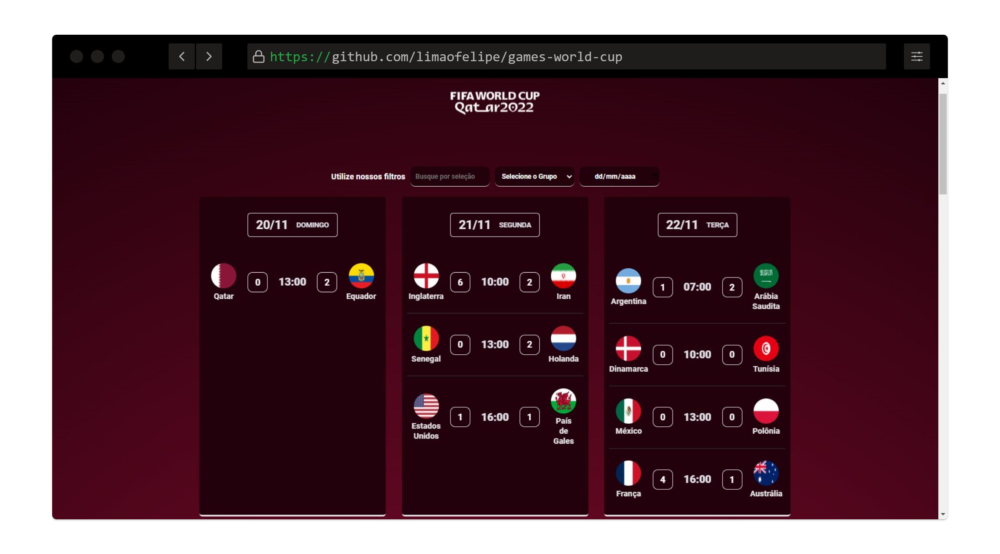

# CALENDÁRIO DE JOGOS COPA DO MUNDO CATAR 2022

<h1 name="sobre">ℹ Sobre o Projeto</h1>
Uma Aplicação Front-End que apresenta os jogos da Fase de grupos da Copa do mundo Catar 2022 desenvolvido com HTML, CSS, JS.


```bash
# Clone Repository
$ git clone https://github.com/limaofelipe/games-world-cup.git
```


